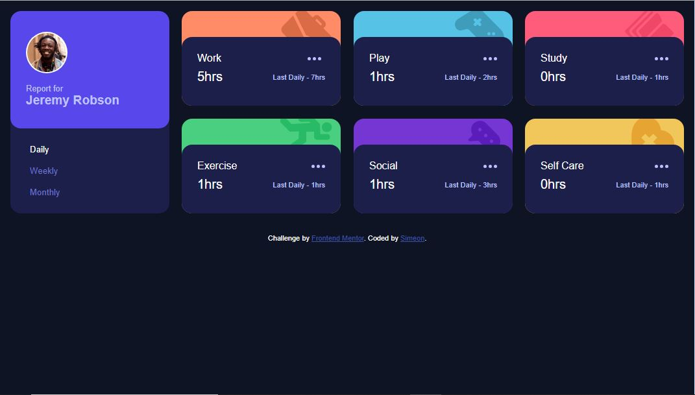

# Frontend Mentor - Time tracking dashboard solution

This is a solution to the [Time tracking dashboard challenge on Frontend Mentor](https://www.frontendmentor.io/challenges/time-tracking-dashboard-UIQ7167Jw). Frontend Mentor challenges help you improve your coding skills by building realistic projects. 

## Table of contents

- [Overview](#overview)
  - [The challenge](#the-challenge)
  - [Screenshot](#screenshot)
  - [Links](#links)
- [My process](#my-process)
  - [Built with](#built-with)
  - [What I learned](#what-i-learned)
  - [Continued development](#continued-development)
  - [Useful resources](#useful-resources)
- [Author](#author)

## Overview

### The challenge

Users should be able to:

- View the optimal layout for the site depending on their device's screen size
- See hover states for all interactive elements on the page
- Switch between viewing Daily, Weekly, and Monthly stats

### Screenshot




### Links

- Solution URL: [Add solution URL here](https://github.com/NobleSimeon/time-tracking-dashboard-main)
- Live Site URL: [Add live site URL here](https://simeon-time-tracking-dashboard.netlify.app)

## My process

### Built with

- Semantic HTML5 markup
- CSS custom properties
- Flexbox
- CSS Grid
- Mobile-first workflow
- Container queries


### What I learned

I learned how to use container queries.


```css
@container (max-width: 240px) {
    .hours {
        flex-direction: column;
        align-items: start;
        gap: .4rem;
    }
    .current-hours {
        font-size: 2.5rem;
    }
    .tabs {
        flex-direction: column;
        align-items: start;
        gap: 0.4rem;
    }
}
```

### Continued development

How to use container queries very well and also to know how to fetch data effectively


### Useful resources

- [Container queries are going to change how we make layouts](https://youtu.be/3_-Je5XpbqY?si=nedXjdhFKeA99bQ1) - This helped me understand container queries.


## Author

- Website - [Ojelabi Simeon](https://github.com/NobleSimeon)
- Frontend Mentor - [@NobleSimeon](https://www.frontendmentor.io/profile/NobleSimeon)
- Twitter - [@SimeonPelumi](https://www.twitter.com/SimeonPelumi)
